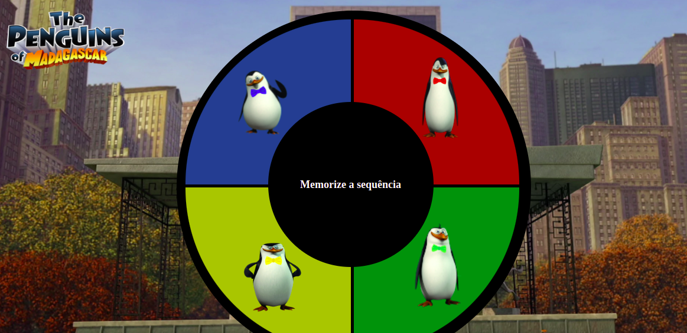

# Entrega: Jogo GENIUS

## Introdução

Jogo da memória criado na década de 80 em que, aleatoriamente, será apresentada uma sequência de luzes e o usuário deverá repetir a sequência sorteada.

### Regras do jogo

O PC sorteará, aleatoriamente, uma sequência de cores que o usuário deverá repetir na ordem correta.

A cada rodada, aumentará uma cor sorteada na sequência. Por exemplo:

- 1ª rodada - sorteada a cor “AZUL”;
- 2ª rodada - sorteada a cor “AMARELA”. Com isso a cor “AZUL” permanece e ficará a seguinte sequência - AZUL - AMARELO;
- 3ª rodada - sorteada a cor “VERDE”. Sendo assim, a sequência será a seguinte - AZUL - AMARELO - VERDE;

E assim por diante, até que o usuário erre a sequência.

### Interface

